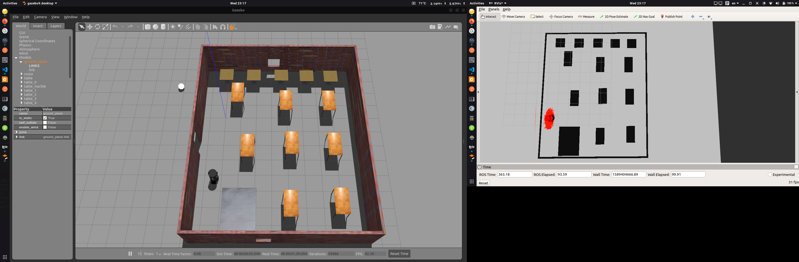
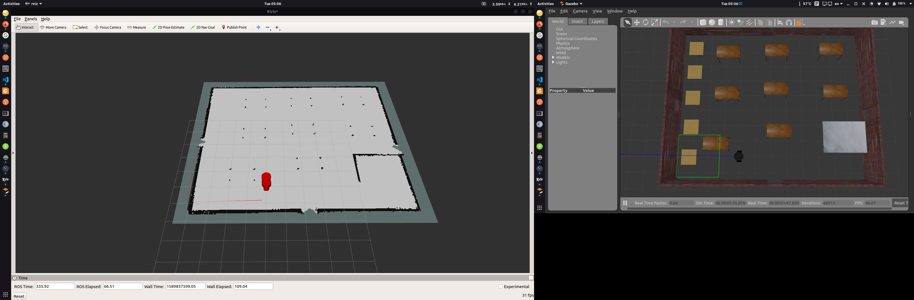

# Barista in a Cafe
* To Launch the simulation: `roslaunch barista_bot world.launch` 
* To move around : `rosrun teleop_twist_keyboard teleop_twist_keyboard.py` 
# AMCL
* To localize the robot using AMCL: `roslaunch barista_bot amcl.launch`

# RTAB-Mapping
* Mapping using the Launch file `roslaunch barista_bot mapping.launch`
* Localization after map generation `roslaunch barista_bot localization.launch`

# Gmapping
* Launch the mapping using `roslaunch barista_bot gmapping.launch`
